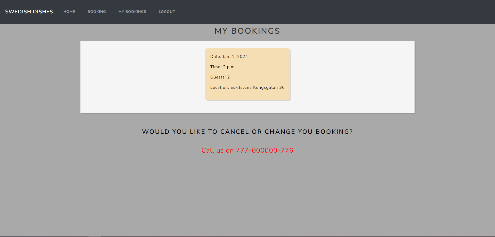

# Welcome to A Swedish dish!

[Link to live site](https://vegan-resturant-2421a5e836cb.herokuapp.com/)

## Introduction
Swedish dishes is a resturant where you can discover Swedish delights. The website has a fully functional admin panel where you can as a admin can book costumers or see if any one has booked a table, when and how many. 

## Contents
* [Project Goals](#project-goals) 
    * [For the user](#for-the-user)
    * [For the site owner](#for-the-admin)
* [User Experience](#user-experience) 
    * [Target audience](#target-audience)
    * [User requirements](#user-requirements)
    * [User Manual](#user-manual)
    * [User Stories](#user-stories)
* [Technical Design](#technical-design)
    * [Flowchart](#flowchart)
* [Features](#features)
    * [App Features](#app-features)
    * [Feature Ideas for future development](#feature-ideas-for-future-development)
* [Technologies Used](#technologies-used)
* [Deployment & Local Development](#deployment--local-development)
* [Testing](#testing)
    * [Validation](#pep8)
    * [Manual Testing](#manual-testing)
    * [Bugs](#bugs)
* [Credits](#credits)

# User Goals

### For the user
- To book a table
- To login 
- To view the resturant news

### For the admin
- Provide a solution for users to book a table online 
- To attract more people that are intrested in swedish cuisine
- To provide a modern and easie application to navigate. 
- Create a website that are responsiv

## User Experience

### Target audience
- Users that wish to book a table for family and friends
- Toursits that are intrested in swedish cuisine.
- Past and new costumers. 

### User requirements
- Fully responsiv
- A warm and welcoming design 
- Accessibility 
- Accessible 

### User Stories
(1) As a user I can navigate across the site with ease thanks to the navigationbar.

(2) As a user I can Register on the site. 

(3) As a user I can login on the site 

(4) As a user I can logout on the site. 

(5) As a user I will get notifications on wether I am logged in, or signed out. 

(6) As a user I can book a table.

(7) As a user I can't double book nor book a time when someone else have booked a table. The resturant require 15 min span. 

(8) As a user I can see the news for the resturant. 

(9) As a user I can see what time and date the news arrived.

(10) As a user I can see an image of the dish from the news or another announcement.

(11) As a user I can see if my booking went through.

(12) As a user I can see if the time I book the table already was booked. 

(13) As a user I can go and see my booking and find out how I can cancel or change the time.

(14) As a user I can add the booking to my google calender.

#### As the site owner
(1) As an admin user I can log in so that I can access the back end of the site.

(2) As an admin I can manually add a booking so that I can book a table if someone calls or sends a email. 

(3) As an admin I can see all the bookings we have gotten. 

(4) As an admin I can get more indepth information about the booking, like time, date and how many people. 

(5) As an admin I can create news for the landing page. 

(6) As an admin I can delete news for the landing page.

(7) As an admin I can help create accounts.

(8) As an admin I can delete accounts. 

### As the Site owner
(1) As a site owner I can provide a fully responsive site for my customers.

(2) As a site owner I can validate data entered into my forms so that all submitted data is correct. 

# Design 

### Colors
I have choosen a darker color theme because I personally love darker sites and it gives me cozy vibes, just like these. 

I choose a darker navbar, a slightly lighter background and then a focus on warm colors like brown and wheat for the content. 

### Font 
I am using the regular bootstrap font Nunito Sans

## Structure 

### Website Pages
The site was designed for the user to be familier with the layout and easy to navigate around in. The navigation bar is clear and is easy to see from desktop. From a smaller device the navbar transform to a hamburger menu with a button to see all the diffrent sites. 

* The site consist of these following pages 
 - HomePages/LandingPage with a picture of the resturant and a warm welcome to the site. In the homepage you as a user can find information about us and why you would like to eat here. If u scroll down you will get to our news list where we add all our news from dishes to big announcement.
 - Login page is the page where you can login to your account. 
 - Register page is the page where you can register. 
 - Logout page is the page where you can sign out from your account
 - Booking page is the page where you as a logged in user can book a table. 
 - My booking is the page where you can see your bookings and add them to your google calender. 

 ## Database 
 * The database is built with Python and the Django framework with a database from Postgres for the deployed Heroky version. 

### Models  

 The first model is the **Customer** wich contains the follwoing:
 * first_name
 * last_name
 * email
 * booking_date 
 * booking_time 
 * number_of_people

The secound model is the **news_image_path** wich contains the following:
* ext
* filename
* logger

 The third model is the **News** wich contains the following:
 * title
 * content
 * image 
 * created_at
 * updated_at

 ## Technologies Used

 ### Languages & Frameworks 

 * HTML
 * CSS 
 * Javascript
 * Python 
 * Django

 ### Libraries & Tools

 * AM I Responsiv
 * Boostrap v5
 * Cloudinary
 * Chrome dev tools
 * Git
 * Github
 * Heroku Platform
 * Postgres
 * Summernote
 * JQuery
 #### Validation
 - Code Institute PEP8 Validation
 - Lighthouse 

 # Features

 #### Homepage
 * Home page includes navbar, main body and the news function. 
 

    <ul>
        <li>
            
            
 Home page 

        </li>

 

 #### Logo and Navigation
* The resutrant name
* Fully responsive
* On smaller devices the navbar switch to hamburger meny 
* book and my bookings only appear if user is logged in 
* IF signed out the user will see sign in 
* Displayed on all images
 

    <ul>
        <li>
            
            
        

 

#### Sign up/Register
* Allow users to create an account
* Username and password is required.
 

    <ul>
        <li>
            
            
        

 

#### Login
* User can login to create a booking, view bookings and add to calender.
 

    <ul>
        <li>
            
            
        

 

#### Logout
* Allows user to log out
* Assures the user if it really want's to log out.
 

    <ul>
        <li>
            
            
        

 

#### book
* Allows the user to book a table 
* Messages are displayed if the data is not valid or the date and time is already booked. 
* Messages are displayed if the data is valid.
 

    <ul>
        <li>
            
            
        </li>

 

#### My bookings
* Allows the user to see there bookings
* Allows the user to add it to google calender
* Gives the user the information it needs to cancel or change there booking.
 

    <ul>
        <li>
            
            
        

 
 

    <ul>
        <li>
            
            
        

 

#### News
* Allows the user to see the news that are posted by the resturant.
 

    <ul>
        <li>
            
            
        

 

### Data Models

* Dictionaries were used to store user data.
    * This helped to verify user input when playing the game. 
* Attributes between functions
    * With the help of the dictionaries the player could change some part of the stories based on ther prefrence. I could use F-strings to change who the player was in the situation with. 

## Features
The website has a single page with several features within the mock python terminal. These features are listed below.

### App Features:

    
Game Title

    
This is what the user sees upon loading the site. 

    <ul>
        <li>
            
Enter name

        </li>
        <li>
            
            
 User story covered: 1-6 

        </li>
        

    

 

    
Activites in the Game 

    
This is what the user sees if the user takes the right path in the living city.  

    <ul>
        <li>
            
Who do you meet? Women or man? 

        </li>
        <li>
            
            
 User story covered: 1-6

        </li>
        

 

    
Activites in the Game 

    
This is what the user sees if the user end up with Mr.Jansson in the cabin and wants to save the side characters.

    <ul>
        <li>
            
What are you going to do?

        </li>
        <li>
            
            
 User story covered: 1-6 

        </li>
        

 

    
Activites in the Game 

    
This is what the user sees if the user add invalid input

    <ul>
        <li>
            
What are you going to do?

        </li>
        <li>
            
            
 User story covered: 7-9 

        </li>
        

 

## feature ideas for future development
In future the website could be further developed and improved to offer more game rules and more diversity. It would be cool to add AI generated images in the future.
- Add more complex storyline with diffrent outcomes
- Add img
- A wider amount of tails. 
- Add more side characters to interact with 

### Flowchart

A flowchart was created using [Lucidchart](https://lucid.app/) to visualise the logic flow of the game.

    
Flowchart

    
A simpel stroll lucidchart

    

 

## Technologies used
### Languages used
Python 

### Other tools 
- Lucidchart was used to create wireframes
- Git was used for version control
- Github Was used for saving and storking files.
- Gitpod Was the IDE used for writing and editing code.
- Heroku  was used as the hosting platform for the site. 

## Why would you want to play this game? 

A Simple Stroll is a game where you, as the player, control the storyline. You control the choices you make and the people you meet along the way. The game is nerve-wracking, making it the perfect "late-night game" when you are alone on a Saturday night in front of your computer.

# Functions
### Input
The player will be able to input their character's name, which will follow throughout the entire story. The player will also be able to input the gender and name of characters they meet during the stroll. If the player meets a woman, the story will use the pronoun "she," and if it's a man, it will use "he."

## Attributes 
- Person_c stands for the person's name.
- Person_c_g stands for gender.
- Pronun stands for pronouns. 
- Username stands for the player´s name.

### Events
There are a lot of events when the player picks the exciting path. The player will always have the option to go home because that’s reality. Who would like to go for a stroll with no option to turn back for like 5 hours?
### Variables 
The people the player meets aren’t static in the game. This makes it important to pass variables further through the game. For example, the variable person_c_g will change a person the player meets from a woman to a man depending on the player's early choices, and their pronouns, of course, are stored in the pronoun variable.

# Testing 

## Validation 
A Simple Stroll passed the PEP8 checks with no errors, as shown in the image below. The game initially had a lot of PEP8 errors, which have been resolved now. 

# Manual testing

### User story testing

|User story|Feature|Test|Expected Result|Actual Result|
|---|---|---|---|---|
| 1. Start Game | start game with username | When the user starts the game, they have an option to choose a username. | If user use only letters they game progess to the Choose path | Works as expected. |

    
Screenshots

    

 

|User story|Feature|Test|Expected Result|Actual Result|
|---|---|---|---|---|
| 2. Choose path | Two diffrent paths | After you input a valid username you will get two paths to choose between. | Program will go the path the user pick. | Works as expected. |

    
Screenshots

     

 

|User story|Feature|Test|Expected Result|Actual Result|
|---|---|---|---|---|
| 3. Death function | Death view | When the user die they will come to the Death function where they have an option to play again or leave. | Program will display 'y' for play again or 'n' for leave| Works as expected. |

    
Screenshots

     

 

|User story|Feature|Test|Expected Result|Actual Result|
|---|---|---|---|---|
| 4. Congratulation function | Congrat view |When the user survive, they will see the congrat function | Program will display 'y' for play again or 'n' for leave | Works as expected. |

    
Screenshots

     

 

|User story|Feature|Test|Expected Result|Actual Result|
|---|---|---|---|---|
| 5. Persons in the story| user input | If the user pick's the correct path, they will be able to create there own characters they meet in the game. | The pronunces changes depending on if the user picks a male of female they meet in the game  | Works as expected. |

    
Screenshots

     
     

 

|User story|Feature|Test|Expected Result|Actual Result|
|---|---|---|---|---|
| 6. Forest path | Path  | When the user picks the forest path.| The user ends up at the right path they pick | Works as expected. |

    
Screenshots

     

 

|User story|Feature|Test|Expected Result|Actual Result|
|---|---|---|---|---|
| 7. City path | other path | When the user picks the city path. | The user ends up at the right path they pick | Works as expected. |

    
Screenshots

     
    

 

|User story|Feature|Test|Expected Result|Actual Result|
|---|---|---|---|---|
| 8. (SITE OWNER)Information | Give information about the game to the user |I started the game to see if I see the information | When the user starts the game, they are going to see information | Works as expected. |

    
Screenshots

     

 

|User story|Feature|Test|Expected Result|Actual Result|
|---|---|---|---|---|
| 9. (SITE OWNER)Ensure that if the user input invalid symbols it ittirate back or inform the user about it. | Ittirate | Give invalid input | When the user use invalid input they are going to ittirate back | Works as expected. |

    
Screenshots

     

 

## Deployment & Local Development
The website was deployed to [Heroku](https://id.heroku.com/) using the following process:
1. Login or create an account at [Heroku](https://dashboard.heroku.com/)

1. Click on New > Create new app in the top right of the screen.

1. Add an app name and select location, then click 'create app'.

1. Under the deploy tab of the next page, select connect to GitHub.
1. Log in to your GitHub account when prompted.

1. Select the repository that you want to be connected to the Heroku app.

1. Click on the settings tab.

1. Scroll down to the config vars section, and add 2 config vars:
    * The first key is CREDS and the value here is the creds.json file that was generated for the google sheets API to work properly.
    * The second key is PORT and the Value is 8000

1. Once you have set up the config vars, scroll down to buildpacks (still under the settings tab)
1. Add the Python and Node.js buildpacks to your app and make sure that when they are displayed, they appear in the order:
    * Python
    * Node.JS

1. Navigate back to the settings tab.
1. Select automatic deploys to allow Heroku to build the site with new changes each time changes are pushed to GitHub.

1. In the 'manual deploy' section beneath this, make sure the branch selected is 'main' and click deploy branch.

1. The site should now be built and Heroku should provide a url for the built site.

This repository can be forked using the following process:
1. On the repository's page, go to the top-right of the page underneath the dark ribbon.
1. Click on the fork button
1. You can now work on a fork of this project. 

This repository can be cloned using the following process:
1. Go to this repository's page on GitHub.
1. Click on the code button (not the one in the navbar, but the one right above the file list).
1. Select an option, HTTPS, SSH, GitHub CLI.
1. Copy the url below to your clipboard.
1. Open Git Bash/your IDE terminal.
1. Ensure the directory you are working in is the correct one you want to paste the project into.
1. Type the command '$ git clone'
1. Paste the URL of the repository after this.
1. Hit enter on your keyboard and the project will be cloned.

## Testing
### Debugging
The site was tested using the following browsers: 
* Google Chrome
* Microsoft Edge

The site was tested on the following devices:
* Desktop (Windows 11)
* Macbook M1 2018(macOS Sonoma 14.3)

### Bugs
1. I found a bug where i didnt define the "username" on the forest trail wich made the application crash.
2. When the player added invalid input it became an infinite loop so I hade to make sure that if they added invalid input they were irritated back to that function.

## Credits

Thanks for the feedback i got from my mentor Mo.
Thanks to my Twitch community who tried the game and gave me feedback. 