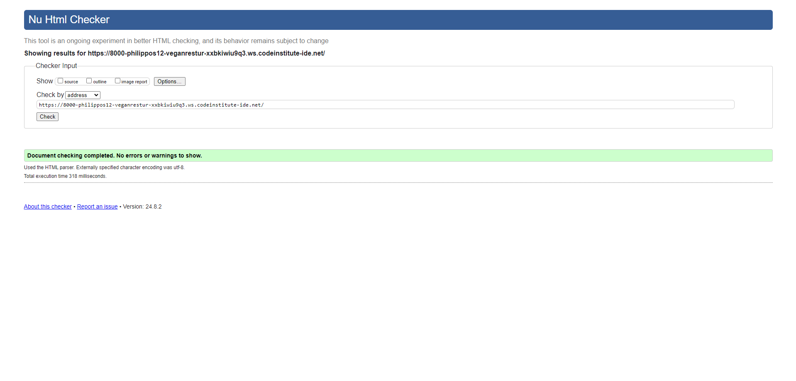

# Welcome to A Swedish dish!

[Link to live site](https://vegan-resturant-2421a5e836cb.herokuapp.com/)

## Introduction
Swedish dishes is a resturant where you can discover Swedish delights. The website has a fully functional admin panel where you can as a admin can book costumers or see if any one has booked a table, when and how many. 

## Contents
* [Project Goals](#project-goals) 
    * [For the user](#for-the-user)
    * [For the site owner](#for-the-admin)
* [User Experience](#user-experience) 
    * [Target audience](#target-audience)
    * [User requirements](#user-requirements)
    * [User Manual](#user-manual)
    * [User Stories](#user-stories)
* [Technical Design](#technical-design)
    * [Flowchart](#flowchart)
* [Features](#features)
    * [App Features](#app-features)
    * [Feature Ideas for future development](#feature-ideas-for-future-development)
* [Technologies Used](#technologies-used)
* [Deployment & Local Development](#deployment--local-development)
* [Testing](#testing)
    * [Validation](#pep8)
    * [Manual Testing](#manual-testing)
    * [Bugs](#bugs)
* [Credits](#credits)

# User Goals

### For the user
- To book a table
- To login 
- To view the resturant news

### For the admin
- Provide a solution for users to book a table online 
- To attract more people that are intrested in swedish cuisine
- To provide a modern and easie application to navigate. 
- Create a website that are responsiv

## User Experience

### Target audience
- Users that wish to book a table for family and friends
- Toursits that are intrested in swedish cuisine.
- Past and new costumers. 

### User requirements
- Fully responsiv
- A warm and welcoming design 
- Accessibility 
- Accessible 

### User Stories
(1) As a user I can navigate across the site with ease thanks to the navigationbar.

(2) As a user I can Register on the site. 

(3) As a user I can login on the site 

(4) As a user I can logout on the site. 

(5) As a user I will get notifications on wether I am logged in, or signed out. 

(6) As a user I can book a table.

(7) As a user I can't double book nor book a time when someone else have booked a table. The resturant require 15 min span. 

(8) As a user I can see the news for the resturant. 

(9) As a user I can see what time and date the news arrived.

(10) As a user I can see an image of the dish from the news or another announcement.

(11) As a user I can see if my booking went through.

(12) As a user I can see if the time I book the table already was booked. 

(13) As a user I can go and see my booking and find out how I can cancel or change the time.

(14) As a user I can add the booking to my google calender.

(15) As a user I can cancel my booking.

(16) As a user I can change my booking.

(17) As a user I get notifications about everything I do from change booking so log in. 

#### As the site owner
(1) As an admin user I can log in so that I can access the back end of the site.

(2) As an admin I can manually add a booking so that I can book a table if someone calls or sends a email. 

(3) As an admin I can see all the bookings we have gotten. 

(4) As an admin I can get more indepth information about the booking, like time, date and how many people. 

(5) As an admin I can create news for the landing page. 

(6) As an admin I can delete news for the landing page.

(7) As an admin I can help create accounts.

(8) As an admin I can delete accounts. 

(9) As an admin I can see if someone deletes an booking.

### As the Site owner
(1) As a site owner I can provide a fully responsive site for my customers.

(2) As a site owner I can validate data entered into my forms so that all submitted data is correct. 

# Design 

### Colors
I have choosen a darker color theme because I personally love darker sites and it gives me cozy vibes, just like these. 

I choose a darker navbar, a slightly lighter background and then a focus on warm colors like brown and wheat for the content. 

### Font 
I am using the regular bootstrap font Nunito Sans

## Structure 

### Website Pages
The site was designed for the user to be familier with the layout and easy to navigate around in. The navigation bar is clear and is easy to see from desktop. From a smaller device the navbar transform to a hamburger menu with a button to see all the diffrent sites. 

* The site consist of these following pages 
 - HomePages/LandingPage with a picture of the resturant and a warm welcome to the site. In the homepage you as a user can find information about us and why you would like to eat here. If u scroll down you will get to our news list where we add all our news from dishes to big announcement.
 - Login page is the page where you can login to your account. 
 - Register page is the page where you can register. 
 - Logout page is the page where you can sign out from your account
 - Booking page is the page where you as a logged in user can book a table. 
 - My booking is the page where you can see your bookings and add them to your google calender. 
 - Cancel booking is the page where you as a logged in user can cancel your booking
 - Update booking is the page where you as a logged in user can change the time, date and amout of guests of your booking. 

 ## Database 
 * The database is built with Python and the Django framework with a database from Postgres for the deployed Heroky version. 

### Models  

 The first model is the **Customer** wich contains the follwoing:
 * first_name
 * last_name
 * email
 * booking_date 
 * booking_time 
 * number_of_people

The secound model is the **news_image_path** wich contains the following:
* ext
* filename
* logger

 The third model is the **News** wich contains the following:
 * title
 * content
 * image 
 * created_at
 * updated_at

 The forth model is the **update_booking** wich containss the following: 
 * update_booking

 The fifth model is the **delete_booking** wich contains the following: 
 * delete_booking

 ## Technologies Used

 ### Languages & Frameworks 

 * HTML
 * CSS 
 * Javascript
 * Python 
 * Django

 ### Libraries & Tools

 * AM I Responsiv
 * Boostrap v5
 * Cloudinary
 * Chrome dev tools
 * Git
 * Github
 * Heroku Platform
 * Postgres
 * Summernote
 * JQuery
 #### Validation
 - Code Institute PEP8 Validation
 - Lighthouse
 - Jshint
 - WC3 Validaotr
 - Jigsaw W3 Validator

 # Features

 #### Homepage
 * Home page includes navbar, main body and the news function. 
 

    <ul>
        <li>
            
            
 Home page 

        </li>

 

 #### Logo and Navigation
* The resutrant name
* Fully responsive
* On smaller devices the navbar switch to hamburger meny 
* book and my bookings only appear if user is logged in 
* IF signed out the user will see sign in 
* Displayed on all images
 

    <ul>
        <li>
            
            
        

 

#### Sign up/Register
* Allow users to create an account
* Username and password is required.
 

    <ul>
        <li>
            
            
        

 

#### Login
* User can login to create a booking, view bookings and add to calender.
 

    <ul>
        <li>
            
            
        

 

#### Logout
* Allows user to log out
* Assures the user if it really want's to log out.
 

    <ul>
        <li>
            
            
        

 

#### book
* Allows the user to book a table 
* Messages are displayed if the data is not valid or the date and time is already booked. 
* Messages are displayed if the data is valid.
 

    <ul>
        <li>
            
            
        </li>

 

#### My bookings
* Allows the user to see there bookings
* Allows the user to add it to google calender
* Gives the user the information it needs to cancel or change there booking.
 

    <ul>
        <li>
            
            
        

 
 

    <ul>
        <li>
            
            
        

 

#### Change booking
* Allows the user to change the booking
 

    <ul>
        <li>
            
            
        </li>

 

#### Cancel booking
* Allows user to cancel a booking
 

    <ul>
        <li>
            
            
        </li>

 

#### News
* Allows the user to see the news that are posted by the resturant.
 

    <ul>
        <li>
            
            
        

 

# Validation 
The W3C markup Validation Service 

    
 Home 

    <ul>
        <li></li>

 

    
 Register 

    <ul>
        <li></li>

 

    
 Login 

    <ul>
        <li></li>

 

    
 Logout 

    <ul>
        <li></li>

 

    
 Booking 

    <ul>
        <li></li>

 

    
 My bookings 

    <ul>
        <li></li>

 

    
 Delete booking 

    <ul>
        <li></li>

 

    
 Edit booking 

    <ul>
        <li></li>

 

## CSS Validaton
The W3C Jigsaw CSS Validation

    
 Style.css 

    <ul>
        <li></li>

 

## Javascript Validation
Jshin JS Validation

    
 Style.css 

    <ul>
        <li></li>

 

## PEP8 Validation
Pep8 Validaton was done through the PEP8 validator from codeinstitute

### Resturant App

    
 Resturant/models 

    <ul>
        <li></li>

 

    
 Resturant/forms 

    <ul>
        <li></li>

 

 Resturant/apps.py 

    <ul>
        <li></li>

 

 Resturant/urls 

    <ul>
        <li></li>
        
I wasn't able to fix the E501 because more errors accured when I tried to move around.

 

 Resturant/views 
S
    <ul>
        <li></li>

 

 Resturant/admin 
S
    <ul>
        <li></li>
        
When I tried to cut the line 20 because of a E501 error I got a E128 error in return

 

## Lighthouse
Performance, best practicees and SEO was tested with lighthouse
**Desktop**

 Home 
S
    <ul>
        <li></li>

 

 Login 
S
    <ul>
        <li></li>

 

 Register 
S
    <ul>
        <li></li>

 

 book a table 
S
    <ul>
        <li></li>

 

 My booking 
S
    <ul>
        <li></li>

 

 Logout 
S
    <ul>
        <li></li>

 

**Mobile**

 home 
S
    <ul>
        <li></li>

 

 Login 
S
    <ul>
        <li></li>

 

 Register 
S
    <ul>
        <li></li>

 

 Book a table 
S
    <ul>
        <li></li>

 

 My booking 
S
    <ul>
        <li></li>

 

 Logout 
S
    <ul>
        <li></li>

 

## Testing

1. Manual testing
2. Automated testing

### Manual testing

1. As a User I can navigate across the site so that I can move to each feature of the site easily

**Step** | **Expected Result** | **Actual Result**
------------ | ------------ | ------------ |
| Click on the 'Home' link in the navigation bar | Homepage will load| Works as expected |
| Click on the 'Register' link in the navigation bar | Sign up page will load| Works as expected |
| Click on the 'Login' link in the navigation bar | Login page will load| Works as expected |
| Click on the 'Book' link in the navigation bar | Booking form will load| Works as expected |
| Click on the 'My Bookings' link in the navigation bar | Users booking will load and show| Works as expected |
| Click on the 'Logout' link in the navigation bar | Logout page will load| Works as expected |

 Logout 

    <ul>
        <li></li>

 

2. As a user I can register on the site

**Step** | **Expected Result** | **Actual Result**
------------ | ------------ | ------------ |
| Click on the register link in the navigation bar  | register page will load| Works as expected |

 Logout 

    <ul>
        <li></li>

 

3. As a user I can login on the site

**Step** | **Expected Result** | **Actual Result**
------------ | ------------ | ------------ |
| Click on the Login link in the navigation bar  | Login page will load| Works as expected |

 Logout 

    <ul>
        <li></li>

 

4. As a user I can logout on the site

**Step** | **Expected Result** | **Actual Result**
------------ | ------------ | ------------ |
| (When logged in ) Click on the logut link in navigationbar | logout page will load| Works as expected |

 Logout 

    <ul>
        <li></li>

 

5. As a user I will get notifications on wether I am logged in, or signed out.

**Step** | **Expected Result** | **Actual Result**
------------ | ------------ | ------------ |
| (When logged in ) When you create an action(Login, Logout, book, cancel, change)The user will get notification  | Notifications happens| Works as expected |

 Logout 

    <ul>
        <li></li>

 

6. As a user I can book a table.

**Step** | **Expected Result** | **Actual Result**
------------ | ------------ | ------------ |
| (When logged in )Click on the booking link in navbar  | booking page will load| Works as expected |

 Logout 

    <ul>
        <li></li>

 

7. As a user I can't double book nor book a time when someone else have booked a table. The resturant require 15 min span.

**Step** | **Expected Result** | **Actual Result**
------------ | ------------ | ------------ |
| Book a time and date that you know is already booked  | Red alert text will show| Works as expected |

 Logout 

    <ul>
        <li></li>

 

8. As a user I can see the news for the resturant.

**Step** | **Expected Result** | **Actual Result**
------------ | ------------ | ------------ |
| Scroll down to the bottom of home page  | You will see news| Works as expected |

 Logout 

    <ul>
        <li></li>

 

9. As a user I can see what time and date the news arrived.

**Step** | **Expected Result** | **Actual Result**
------------ | ------------ | ------------ |
| Scroll down to the bottom of home page  | You will see time and date to the left belov the img| Works as expected |

 Logout 

    <ul>
        <li></li>

 

10. As a user I can see an image of the dish from the news or another announcement.

**Step** | **Expected Result** | **Actual Result**
------------ | ------------ | ------------ |
| Scroll down to the bottom of home page  | You will see an image for every news| Works as expected |

 Logout 

    <ul>
        <li></li>

 

11. As a user I can see if my booking went through.

**Step** | **Expected Result** | **Actual Result**
------------ | ------------ | ------------ |
| Book a time and date you know is free | Green notification will pop up with text| Works as expected |

 Logout 

    <ul>
        <li></li>

 

12. As a user I can see if the time I book the table already was booked.

**Step** | **Expected Result** | **Actual Result**
------------ | ------------ | ------------ |
| Book a time and date that you know is already booked  | Red alert text will show| Works as expected |

 Logout 

    <ul>
        <li></li>

 

13. As a user I can go and see my booking and cancel or change.

**Step** | **Expected Result** | **Actual Result**
------------ | ------------ | ------------ |
| Click on my booking link in navbar  | My booking page will load| Works as expected |

 Logout 

    <ul>
        <li></li>

 

14. As a user I can add the booking to my google calender.

**Step** | **Expected Result** | **Actual Result**
------------ | ------------ | ------------ |
| Inside my booking is a wheat colors box, click there and pop up window will appear  | pop up window will load| Works as expected |

 Logout 

    <ul>
        <li>
        </li>

 

15. As a user I can cancel my booking.

**Step** | **Expected Result** | **Actual Result**
------------ | ------------ | ------------ |
| In my booking you will se a red button belov your booking, press there  | cancel page will load| Works as expected |

 Logout 

    <ul>
        <li></li>

 

16. As a user I can change my booking.

**Step** | **Expected Result** | **Actual Result**
------------ | ------------ | ------------ |
| In my booking you will se a green button belov your booking, press there  | change page will load| Works as expected |

 Logout 

    <ul>
        <li></li>

 

17. As a user I get notifications about everything I do from change booking so log in.

**Step** | **Expected Result** | **Actual Result**
------------ | ------------ | ------------ |
| Try to log in, logout or book a table  | Notifications will load| Works as expected |

 Logout 

    <ul>
        <li></li>

 

## Bugs

## Deployment & Local Development
The website was deployed to [Heroku](https://id.heroku.com/) using the following process:
1. Login or create an account at [Heroku](https://dashboard.heroku.com/)

1. Click on New > Create new app in the top right of the screen.

1. Add an app name and select location, then click 'create app'.

1. Under the deploy tab of the next page, select connect to GitHub.
1. Log in to your GitHub account when prompted.

1. Select the repository that you want to be connected to the Heroku app.

1. Click on the settings tab.

1. Scroll down to the config vars section and add the configs needed.

1. Once you have set up the config vars, scroll down to buildpacks (still under the settings tab)
1. Add the Python and Node.js buildpacks to your app and make sure that when they are displayed, they appear in the order:

1. Navigate back to the settings tab.
1. Select automatic deploys to allow Heroku to build the site with new changes each time changes are pushed to GitHub.

1. In the 'manual deploy' section beneath this, make sure the branch selected is 'main' and click deploy branch.

1. The site should now be built and Heroku should provide a url for the built site.

This repository can be forked using the following process:
1. On the repository's page, go to the top-right of the page underneath the dark ribbon.
1. Click on the fork button
1. You can now work on a fork of this project. 

This repository can be cloned using the following process:
1. Go to this repository's page on GitHub.
1. Click on the code button (not the one in the navbar, but the one right above the file list).
1. Select an option, HTTPS, SSH, GitHub CLI.
1. Copy the url below to your clipboard.
1. Open Git Bash/your IDE terminal.
1. Ensure the directory you are working in is the correct one you want to paste the project into.
1. Type the command '$ git clone'
1. Paste the URL of the repository after this.
1. Hit enter on your keyboard and the project will be cloned.

## Testing
### Debugging
The site was tested using the following browsers: 
* Google Chrome
* Microsoft Edge

The site was tested on the following devices:
* Desktop (Windows 11)
* Macbook M1 2018(macOS Sonoma 14.3)

## Credits
Thanks for the feedback i got from my mentor Mo.
